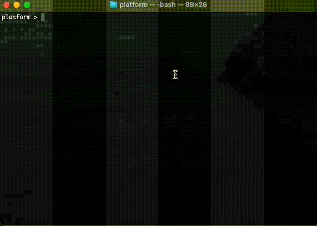
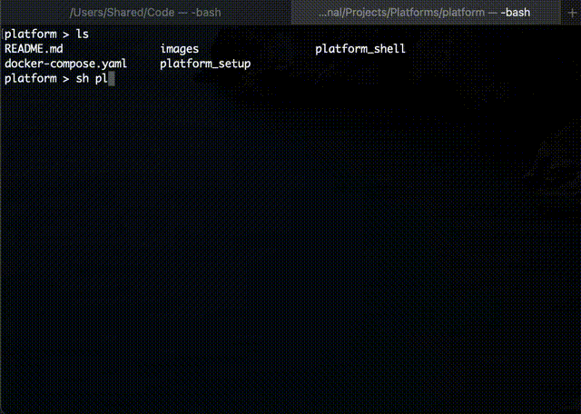

# Platform
This document deals with different platforms to run lab tests 

## Docker Setup

use the link to https://docs.docker.com/desktop/mac/install/ install docker on MAC

use the link to https://docs.docker.com/desktop/windows/install/ install docker on Windows 

## Verify Docker installation 

Open your terminal and execute the following command 

`docker run --rm hello-world`

You will be able to see the following message for the successful docker installation 

```
Hello from Docker!
This message shows that your installation appears to be working correctly.

To generate this message, Docker took the following steps:
 1. The Docker client contacted the Docker daemon.
 2. The Docker daemon pulled the "hello-world" image from the Docker Hub.
    (amd64)
 3. The Docker daemon created a new container from that image which runs the
    executable that produces the output you are currently reading.
 4. The Docker daemon streamed that output to the Docker client, which sent it
    to your terminal.

To try something more ambitious, you can run an Ubuntu container with:
 $ docker run -it ubuntu bash

Share images, automate workflows, and more with a free Docker ID:
 https://hub.docker.com/

For more examples and ideas, visit:
 https://docs.docker.com/get-started/

```


## Work Space
This section deals with workspace settings of the platform docker. 
Create a directory at your preferred location and update the path `SHARED_VOLUME_PATH` in the file `platform_setup`

For Example, follow steps are required setup a new directory name `Code` on your host and map it to your container 



### Windows

Follow the above steps to edit and run the file `platform_setup.bat`

## Setup the container 

Run the following command to bring up the platform

`sh platform_setup`

To get the command shell

`sh platform_shell`

The command `sh platform_shell` can run on multiple windows to launch multiple shell prompts of the container

### Windows

Follow the above steps and run the file `platform_shell.bat`


## First Program

Simple example to create and execute c program

`platform` shell will point to docker shell where the program will get compiled and executed 

`Code` shell will be the directory on host, which got mapped to docker container. Always create program on host directory and same will be available in container, which can be compiled and executed



